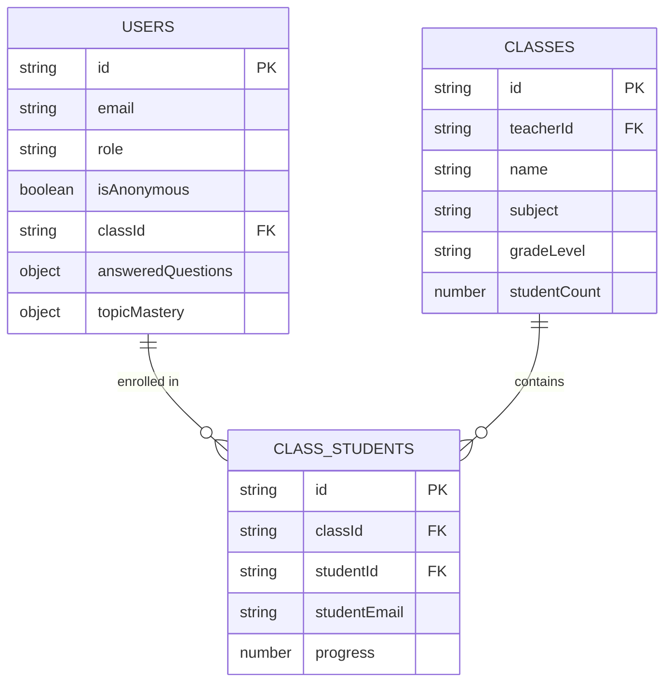

# Math Whiz App - Firestore Data Model Documentation

This document describes the complete Firestore database structure used by the Math Whiz App. The application uses a multi-tenant architecture with an application ID (`appId`) to separate different instances.

## Quick Reference

| Collection | Purpose | Key Fields | Access Control |
|------------|---------|------------|----------------|
| `users` | Student/teacher profiles and progress | `role`, `answeredQuestions`, `topicMastery` | Self + Teachers (for students) |
| `classes` | Teacher-created class information | `teacherId`, `name`| Class teachers + admin |
| `classStudents` | Student enrollment in classes | `classId`, `studentId`, `progress` | Class teachers + admin |


📚 **See also**: [Data Examples Document](./FIRESTORE_DATA_EXAMPLES.md) for concrete examples and sample queries.

## Overview

The Firestore database follows a hierarchical structure:
```
artifacts/
├── {appId}/
    ├── users/
    ├── classes/
    ├── classStudents/
```

The default `appId` is `"default-app-id"` unless configured otherwise.

## Collection Structure

### 1. Root Collection: `artifacts`

The root collection that contains all application data. This allows for multi-tenancy.

**Path**: `/artifacts/{appId}`

### 2. Users Collection

Stores user profile information and student progress data.

**Path**: `/artifacts/{appId}/users/{userId}/math_whiz_data/profile`

#### User Document Structure

```typescript
{
  // Basic profile information
  id: string,                    // Firebase Auth UID
  email?: string,               // User's email (if registered)
  displayName?: string,         // User's display name
  role: 'student' | 'teacher' | 'admin',
  
  // Student-specific fields
  isAnonymous?: boolean,        // True for guest/anonymous users
  classId?: string,            // Class the student belongs to
  createdAt: Date,             // Account creation timestamp
  convertedAt?: Date,          // When anonymous user was converted to registered
  
  // Progress tracking
  answeredQuestions?: Array<{
    questionId: string,
    topic: string,
    difficulty: number,
    isCorrect: boolean,
    date: string,              // YYYY-MM-DD format
    timestamp: Date,
    timeSpent: number,         // milliseconds
    complexity?: number
  }>,
  
  // Mastery tracking per topic
  topicMastery?: {
    [topicKey: string]: {
      level: number,           // Current mastery level
      questionsAnswered: number,
      correctAnswers: number,
      lastUpdated: Date
    }
  },
  
  // Daily progress tracking by grade
  progressByGrade?: {
    [date: string]: {          // YYYY-MM-DD format
      G3?: {
        [sanitizedTopic: string]: {
          correct: number,
          incorrect: number,
          timeSpent: number      // milliseconds
        }
      },
      G4?: {
        [sanitizedTopic: string]: {
          correct: number,
          incorrect: number,
          timeSpent: number      // milliseconds
        }
      }
    }
  },
  
  // Legacy progress tracking (for backward compatibility)
  progress?: {
    [date: string]: {          // YYYY-MM-DD format
      [sanitizedTopic: string]: {
        correct: number,
        incorrect: number,
        timeSpent: number      // milliseconds
      }
    }
  },
  
  // Daily goals by grade
  dailyGoalsByGrade?: {
    G3?: {
      [topic: string]: number  // Goal count per topic
    },
    G4?: {
      [topic: string]: number  // Goal count per topic
    }
  },
  
  // Legacy daily goals (for G3 backward compatibility)
  dailyGoals?: {
    [topic: string]: number    // Goal count per topic
  },
  
  // Quiz state management
  pausedQuizzes?: {
    [topic: string]: {
      questions: Array<QuestionObject>,
      index: number,           // Current question index
      score: number           // Current score
    }
  },
  
  // Complexity engine data
  lastAskedComplexityByTopic?: {
    [topic: string]: number   // Last difficulty asked for each topic
  },
  
  // Gamification features
  coins?: number,
  ownedBackgrounds?: string[], // Array of background IDs
  activeBackground?: string,   // Currently selected background ID
  
  // Daily stories (AI-generated content tracking)
  dailyStories?: {
    [date: string]: {          // YYYY-MM-DD format
      [topic: string]: {
        story: string,
        cached: boolean
      }
    }
  },
  
  // Performance statistics
  totalCorrect?: number,
  totalAnswered?: number,
  currentStreak?: number,
  longestStreak?: number,
  points?: number,
  
  // Settings and preferences
  preferredDifficulty?: number,
  lastActiveDate?: string,     // YYYY-MM-DD format
  
  // Admin/Teacher specific
  isAdmin?: boolean,
  needsPasswordReset?: boolean
}
```

### 3. Classes Collection

Stores information about teacher-created classes.

**Path**: `/artifacts/{appId}/classes/{classId}`

#### Class Document Structure

```typescript
{
  id: string,                  // Auto-generated class ID
  teacherId: string,           // Firebase Auth UID of the teacher
  name: string,               // Class name (e.g., "Math 4A")
  subject: string,            // Subject name (e.g., "Mathematics")
  gradeLevel: string,         // Grade level (e.g., "4th Grade")
  description?: string,       // Optional class description
  period?: string,           // Class period (e.g., "1st Period")
  createdAt: Date,           // Class creation timestamp
  updatedAt: Date,           // Last modification timestamp
}
```

### 4. Class Students Collection

Manages the relationship between students and classes (enrollment).

**Path**: `/artifacts/{appId}/classStudents/{enrollmentId}`

#### Class Student Document Structure

```typescript
{
  id: string,                 // Auto-generated enrollment ID
  classId: string,           // Reference to class document
  studentId: string,         // Firebase Auth UID of the student
  studentEmail?: string,     // Student's email (if available)
  studentName?: string,      // Student's display name
  joinedAt: Date,           // When student joined the class
}
```

The application uses Firebase Auth custom claims for authorization:

- **Admin Users**: Have `admin: true` custom claim
- **Teachers**: Have `admin: true` custom claim but `role: 'teacher'` in Firestore profile
- **Students**: No custom claims, `role: 'student'` in Firestore profile

### Role-Based Access Control

1. **Students**: Can only access their own data and basic app functionality
2. **Teachers**: Can access their classes and enrolled students' data
3. **Admins**: Have full access to all data

## Data Relationships



## Common Query Patterns

### 1. Get All Students for a Teacher

```javascript
// Get teacher's classes
const classesRef = db.collection(`artifacts/${appId}/classes`);
const teacherClassesQuery = classesRef.where('teacherId', '==', teacherId);

// Get students in those classes
const studentsRef = db.collection(`artifacts/${appId}/classStudents`);
const classStudentsQuery = studentsRef.where('classId', 'in', classIds);
```

### 2. Get Student Progress Data

```javascript
const userRef = db.doc(`artifacts/${appId}/users/${userId}`);
const userProfileRef = db.doc(`artifacts/${appId}/users/${userId}/math_whiz_data/profile`);
```

### 3. Get Classes for a Teacher

```javascript
const classesRef = db.collection(`artifacts/${appId}/classes`);
const query = classesRef.where('teacherId', '==', teacherId);
```

### 4. Get Students in a Class

```javascript
const studentsRef = db.collection(`artifacts/${appId}/classStudents`);
const query = studentsRef.where('classId', '==', classId);
```

## Security Rules Considerations

The application should implement Firestore security rules to:

1. Allow users to read/write only their own user documents
2. Allow teachers to read student data only from their classes
3. Allow admins to read/write all data
4. Prevent unauthorized access to teacher and class data

## Data Migration Notes

- The system supports multiple user profile locations for backward compatibility
- Anonymous users can be converted to registered users while preserving their progress
- Student enrollment in classes is tracked separately from user profiles

## Performance Considerations

1. **Indexing**: Ensure composite indexes for common query patterns:
   - `classes`: `teacherId`
   - `classStudents`: `classId`, `studentId`
   - `users`: `role`, `classId`

2. **Pagination**: For large datasets, implement pagination using Firestore cursors

3. **Real-time Updates**: Use Firestore listeners for real-time updates in teacher dashboards

## Constants and Enums

### User Roles
```javascript
const USER_ROLES = {
  STUDENT: 'student',
  TEACHER: 'teacher', 
  ADMIN: 'admin'
};
```

### Topics
Available math topics are defined in `/src/constants/topics.js`

## API Endpoints

The application uses Netlify Functions for server-side operations:

- `/.netlify/functions/get-all-students` - Get student data (admin/teacher only)
- `/.netlify/functions/classes` - CRUD operations for classes
- `/.netlify/functions/class-students` - Manage class enrollment
- `/.netlify/functions/create-teacher` - Create teacher accounts (admin only)
- `/.netlify/functions/get-all-teachers` - Get teacher data (admin only)

All endpoints require Firebase Auth token in Authorization header.